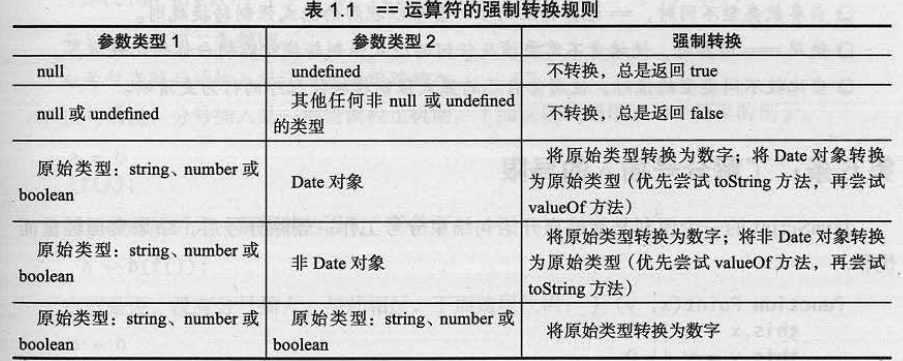

## 算术运算符

#### 1. 算术运算符 + - * /  %

1. 如果 + 两边有一边是字符串，那么就是拼接
2. `-  *  /  %` 如果两边都是数字，那就是数学意义上的运算符，

假如有一边是数字，另外一边不是数字，那么会尝试把不是数字的转换为数字，再进行运算，如果没有办法转换为数字，那么就是 `NaN`。

3.  NaN (not a number) 不是一个数字

NaN 的数据类型是 `number`

`isNaN()` 用来检测一个对象是不是 NaN，如果是 NaN 那么返回 true，反之false

4. % 取余/模


#### 2. 赋值运算符

=    +=     -=     *=     /=    ++    --    %=


#### 3. 比较运算符

\>     <    >=    <=    !=    ==    ===    !==


#### 4.逻辑运算符

&&	与（逻辑与） 并且，遇到true就通过，遇到false就停止

|| 	或（逻辑或）或者，遇到false就通过，遇到true就停止

！	非  取反


**注意：** && 比 || 优先级还高一点

```js
var a = 1; 
var b = null;
var c = '12344';
var d = [];
var e = function(){

}
var z = a && b;   //null
var h = 0 || b && d || c && e;  //function(){}
var i = b&&d; //null
```


#### 5. 前置++ 和 后置++ 的区别

>前置++  先自己递增1后，再去执行其他的运算
>
>后置++  先把自己原来的值拿去进行其他运算后，再自己递增
>
>当前置++或者后置++是一条独立语句，并且没有其他运算的时候，没有什么区别


```js
var x = 5;
var y = x++;
//y = x; x=x+1;  y=5 x = 6;
/******************************************************/
var x = 5;
var y = ++x;
//x = x + 1; y = x; 	x = 6 y = 6;
```


## 类型转换

### 一、显示类型转换

#### 1. Number()

转换的必须是一个数字字符串，否则会是NaN。会排除开始和结尾的空格，中间的空格不会被过滤。从第一位不是空格的字符串开始一直到最后，如果发现不是一个常规的数字，就会返回NaN。


#### 2. parseInt()

遇到非数字停下来，从第一个不是空格的字符开始，遇到不是数字的地方结束，过滤小数部分。


#### 3. parseFloat()

遇到非数字停下来，从第一个不是空格的字符开始，到不是数字的地方结束，但是允许小数点出现一次。


**这三种最后无论转换成什么值，都是 Number 类型**

```js
var str = "100.123px";
alert( Number( str ) ); //NaN;
alert( parseInt(str) ); // 100
alert( parseFloat(str) ); //100.123
```


### 二、隐式类型转换

```js
+  -  *  /
```

#### 1. 加法 字符拼接

```js
var num = 1;
var sum = num + "1"; // 字符拼接

sum // 11 string类型
```


#### 2. 除法

```js
var num2 = 10;
var sum2 = num2 / "2";
console.log(typeof sum2);  //Number 5
```


#### 3. 乘法

```js
var num3 = 10;
var sum3 = num3 * 2;
console.log(typeof sum3); // Number 20
```


#### 4. 减法

```js
var num4 = 10;
var sum4 = 10 - "1";
console.log(typeof sum4); // Number 9
```


#### 5. Number 转换

```js
var num5 = "10/2";
console.log(Number(num5)); //NaN
```


### 三、== 的转换规则

#### 1. 归纳总结转换规则

> 1. number 类型与 string 类型比较，string 类型会转换为 number 类型
> 2. null 和 undefined 类型比较始终相等。
> 3. 布尔类型与其它任何类型进行比较，布尔类型将会转换为 number 类型
> 4. number类型 或 string类型 与 object 类型进行比较，number或者 string 类型会转换为object 类型。（后一句话应该是错误的，Object类型会调用toString（）或者valueOf（）转换为字符串在进行判断比较）


#### 2. 转换规则的一些案例

```js
console.log(Number('')); // 0
console.log(Number('     ')); // 0
console.log(Number(true)); // 1
console.log(Number(false)); // 0
```


```js
number类型与string类型比较，string会转换为number类型
'' == '0' //false
0 == ''//true;
0 == '0'//true
' \t\r\n '==0//true
```


```js
null和undefined类型比较始终相等

null == undefined //true
```


```js
布尔类型与其它任何类型进行比较，布尔类型将会转换为number类型
false == 'false'//false
false == '0'//true
false == null//false
```


#### 3. 转换规则表

| 参数类型1                         | 参数类型2                         | 强制转换                                                     |
| --------------------------------- | --------------------------------- | ------------------------------------------------------------ |
| null                              | undefined                         | 不转换，总是返回true                                         |
| null或undefined                   | 其他任何非null或undefined的类型   | 不转换，总是返回false                                        |
| 原始类型：string、number或boolean | Date对象                          | 将原始类型转换为数字；将Date对象转换为原始类型（优先尝试toString方法，再尝试valueOf方法） |
| 原始类型：string、number或boolean | 非Date对象                        | 将原始类型转换为数字；将非Date对象转换为原始类型（优先尝试valueOf方法，再尝试toString方法） |
| 原始类型：string、number或boolean | 原始类型：string、number或boolean | 将原始类型转换为数字 （这里应该是两者类型不同才会这样改变）  |

null没有 toStirng 和 valueOf 方法，因此它与其他值除了 undefined外都返回 false


